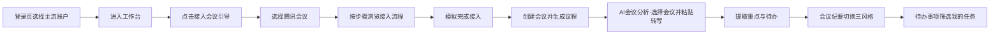

# MeetEase 智能视频会议助手 — 产品需求文档（PRD）

| 属性 | 内容 |
|------|------|
| **产品名称** | MeetEase 智能视频会议助手 |
| **文档版本** | v1.2.0 |
| **文档状态** | 已发布（与当前 Demo 实现一致） |
| **最后更新** | 2026-05-16 |
| **产品阶段** | 测评演示版（前端原型，无后端） |
| **维护人** | 产品 / 项目组 |

> **文档维护约定**：任何功能新增、修改、下线，须在同一迭代内更新本 PRD，并同步 [CHANGELOG.md](./CHANGELOG.md) 与 [README.md](../README.md) 中的功能摘要。详见 [§12 文档维护规范](#12-文档维护规范)。

---

## 目录

1. [产品概述](#1-产品概述)
2. [背景与问题定义](#2-背景与问题定义)
3. [目标用户与场景](#3-目标用户与场景)
4. [产品目标与成功指标](#4-产品目标与成功指标)
5. [产品范围](#5-产品范围)
6. [信息架构与导航](#6-信息架构与导航)
7. [用户旅程](#7-用户旅程)
8. [功能需求详述](#8-功能需求详述)
9. [AI 能力说明（演示版）](#9-ai-能力说明演示版)
10. [非功能需求](#10-非功能需求)
11. [交互与视觉规范](#11-交互与视觉规范)
12. [文档维护规范](#12-文档维护规范)
13. [版本规划](#13-版本规划)
14. [附录](#14-附录)

---

## 1. 产品概述

### 1.1 一句话描述

MeetEase 是一款面向办公场景的 **轻量级 AI 视频会议助手**，覆盖 **会前准备 → 会中记录 → 会后纪要 → 任务跟进** 全链路，并可引导用户接入腾讯会议、钉钉、飞书等主流视频会议平台。

### 1.2 产品定位

| 维度 | 说明 |
|------|------|
| **品类** | B 端效率工具 / 会议智能助手 |
| **差异化** | 聚焦会议全链路，而非单点转写或单点纪要 |
| **当前形态** | Web 单页应用（SPA），本地模拟数据 + 模板化 AI，用于 **产品测评与方案演示** |
| **未来形态** | 对接真实 ASR、大模型、会议平台 Open API 与企业 SSO |

### 1.3 核心价值主张

- **会前**：结构化会议信息，AI 生成议程与准备清单，降低会议准备成本。
- **会中**：基于转写文本提取结论、风险与待办（演示为粘贴导入）。
- **会后**：多风格纪要一键生成、复制与邮件草稿。
- **跟进**：待办集中管理，支持「我的待办」个人视角筛选。
- **接入**：分平台、分步骤引导接入视频会议软件，降低上手门槛。

---

## 2. 背景与问题定义

### 2.1 行业背景

远程与混合办公普及后，视频会议成为日常协作主场景。用户在会前、会中、会后均存在信息处理负担，且会议数据分散在各类会议客户端中。

### 2.2 用户痛点

| 痛点 | 描述 | MeetEase 应对 |
|------|------|----------------|
| 信息分散 | 议程、录音、纪要、待办分布在不同工具 | 统一工作台与模块串联 |
| 纪要耗时 | 人工整理纪要平均占用 30–60 分钟 | AI 生成多风格纪要（演示为模板） |
| 待办遗漏 | 口头分配任务易遗忘 | 会中识别待办 + 待办列表跟踪 |
| 会后跟进弱 | 缺乏标准化会后邮件与任务闭环 | 纪要导出 + 会后邮件 + 待办状态 |
| 工具接入难 | 不知如何将助手与腾讯会议等打通 | 「接入会议」分平台引导 |

### 2.3 产品边界（当前版本）

- ✅ 前端交互完整、可演示端到端流程  
- ✅ 本地模拟数据与预设 AI 模板  
- ❌ 无用户账号体系、无真实会议平台 API、无持久化服务端存储  
- ❌ 无实时语音采集（需用户粘贴转写或按引导在平台侧操作）

---

## 3. 目标用户与场景

### 3.1 目标用户

| 用户角色 | 典型诉求 | 使用频率 |
|----------|----------|----------|
| **项目经理** | 排期会、站会、里程碑会；需要 RAID、Action Items | 高 |
| **产品经理** | 需求评审、规划会；需要结论与需求基线纪要 | 高 |
| **研发 / 设计** | 技术评审、方案对齐；关注待办与个人任务 | 中 |
| **普通参会者** | 快速了解自己负责的待办 | 中 |
| **IT / 管理员（演示）** | 了解如何为企业接入会议平台 | 低 |

### 3.2 典型场景

1. **会前 10 分钟**：创建会议 → AI 生成议程 → 发给参会人。  
2. **会中**：在会议软件开转写，会后将文本粘贴至「会议记录」。  
3. **会后 15 分钟**：提取重点 → 生成纪要（正式版）→ 复制并发送跟进邮件。  
4. **日常**：在「待办事项」筛选「张三」的待办并更新状态。  
5. **首次使用**：从导航「接入会议」或工作台引导条完成平台接入 walkthrough。

---

## 4. 产品目标与成功指标

### 4.1 业务目标（演示阶段）

- 支撑产品测评汇报，完整展示 **会议全链路** 能力蓝图。  
- 让评委 / 干系人在 **5 分钟内** 理解产品价值与差异化。  
- 验证信息架构与核心交互是否符合用户心智。

### 4.2 成功指标（测评演示可观测）

| 指标 | 定义 | 目标（演示） |
|------|------|----------------|
| 链路完成率 | 用户从工作台 → 创建 → 记录 → 纪要 → 待办是否可走通 | 100% 主路径可点击完成 |
| 接入引导触达 | 进入「接入会议」页的用户占比 | 测评脚本要求首屏可见 |
| 纪要风格理解 | 用户能否区分简洁 / 正式 / 项目管理三版 | 内容结构明显不同 |
| 我的待办可用性 | 选择负责人后筛出对应任务 | 筛选结果准确 |

### 4.3 未来版本指标（上线后参考）

- 单次会议纪要生成时长 &lt; 3 分钟  
- 待办闭环率（7 日内状态更新）&gt; 60%  
- 企业客户平台接入配置完成率 &gt; 80%

---

## 5. 产品范围

### 5.1 功能模块总览

```
MeetEase
├── 登录（/login）            ← 主流账户登录，首次自动注册助手账户
├── 工作台（/）
├── 接入会议（/integration）  ← 首次使用主入口
├── 创建会议（/create）       ← 会前
├── AI 会议分析（/analysis）  ← 会中/会后智能分析（/record 重定向）
├── 会议纪要（/minutes）      ← 会后
└── 待办事项（/tasks）        ← 跟进
```

### 5.2 版本范围矩阵

| 模块 | v1.0 演示版 | 说明 |
|------|-------------|------|
| 工作台 | ✅ | 统计、引导、快捷入口、摘要列表 |
| 接入会议 | ✅ | 5 平台引导 + 模拟接入 |
| 创建会议 | ✅ | 表单 + AI 议程 |
| AI 会议分析 | ✅ | 多会议选择 + 转写 + 三类 AI 分析 |
| 会议纪要 | ✅ | 三风格 + 复制 + 邮件 |
| 待办事项 | ✅ | 表格 + 筛选 + 我的待办 |
| 用户登录 | ✅ | 7 种渠道模拟登录 + 助手账户自动注册 |
| 真实 OAuth / 服务端账户 | ❌ | 后续版本 |
| 真实 AI / API | ❌ | 后续版本 |

---

## 6. 信息架构与导航

### 6.1 全局导航（顶栏）

| 顺序 | 名称 | 路由 | 优先级 | 说明 |
|------|------|------|--------|------|
| 1 | **接入会议** | `/integration` | P0 | 高亮强调（靛蓝紫渐变），标签「入门」 |
| 2 | 工作台 | `/` | P0 | 默认首页 |
| 3 | 创建会议 | `/create` | P0 | |
| 4 | AI 会议分析 | `/analysis` | P0 | 原「会议记录」已更名 |
| 5 | 会议纪要 | `/minutes` | P0 | |
| 6 | 待办事项 | `/tasks` | P0 | |

**品牌区**：MeetEase Logo + 副标题；宽屏展示「产品测评 Demo」标签。

**页脚**：声明「产品测评演示版 · 数据均为本地模拟」。

**用户区**（已登录）：头像 + 昵称；下拉展示助手 ID、邮箱、登录渠道、退出登录。

**访问控制**：未登录访问业务路由 → 跳转 `/login`，登录后回到原目标页。

### 6.2 页面标题规范

各页使用统一 `PageHeader`：主标题 + 副标题 + 场景徽章（概览 / 接入 / 会前 / 会中 / 会后 / 跟进）。

---

## 7. 用户旅程

### 7.1 新用户首次旅程（推荐测评脚本）



### 7.2 日常用户旅程

工作台查看概览 → 快捷入口进入目标模块 → 完成操作 → 返回工作台。

---

## 8. 功能需求详述

以下需求编号格式：**模块-序号**。优先级：P0 必须有，P1 应该有，P2 可延后。

---

### 8.0 模块：用户登录与助手账户（`/login`）

> 演示版通过本地 `localStorage` 模拟 OAuth；不发起真实第三方授权请求。

| 编号 | 需求 | 优先级 | 验收标准 |
|------|------|--------|----------|
| AUTH-01 | 登录页展示 7 种登录方式 | P0 | 微信、钉钉、飞书、企业微信、手机号、Google、GitHub |
| AUTH-02 | 点击登录模拟授权过程 | P0 | 约 1s 加载态，按钮禁用防重复提交 |
| AUTH-03 | 首次登录自动注册助手账户 | P0 | 生成唯一 `assistantId`（ME-日期-随机码），写入用户库 |
| AUTH-04 | 再次登录同一渠道账户 | P0 | 识别已有账户，不重复注册 |
| AUTH-05 | 未登录拦截业务页 | P0 | 跳转 `/login`，携带 `from` 回跳路径 |
| AUTH-06 | 顶栏用户菜单 | P0 | 展示昵称、邮箱、助手 ID、登录渠道 |
| AUTH-07 | 退出登录 | P0 | 清除会话，跳转登录页 |
| AUTH-08 | 新用户欢迎提示 | P1 | 首次注册后工作台 Toast 展示助手 ID |
| AUTH-09 | 待办页关联登录用户 | P1 | 登录名与演示负责人一致时自动选中「我是」 |

**助手账户数据结构（localStorage）**

| 字段 | 说明 |
|------|------|
| assistantId | MeetEase 助手唯一 ID |
| provider | 登录渠道标识 |
| providerUserId | 第三方账户 ID（模拟） |
| displayName | 显示昵称 |
| email | 邮箱（模拟） |
| createdAt | 注册时间 ISO |

---

### 8.1 模块：工作台（`/`）

| 编号 | 需求 | 优先级 | 验收标准 |
|------|------|--------|----------|
| HOME-01 | 展示今日会议数量 | P0 | 读取模拟数据，数字正确展示 |
| HOME-02 | 展示待完成任务数量 | P0 | 同上 |
| HOME-03 | 接入会议引导卡片（首屏） | P0 | 位于统计卡片之上；含「首次使用推荐」标签与「查看接入指南」主按钮 |
| HOME-04 | 快捷入口胶囊 | P1 | 4 个入口：创建会议、AI 会议分析、会议纪要、待办事项，点击跳转正确 |
| HOME-05 | 最近会议纪要列表 | P0 | 展示标题、日期、摘要，≥1 条 |
| HOME-06 | 高优先级待办列表 | P0 | 展示任务、负责人、截止日、优先级标签 |
| HOME-07 | PageHeader 场景徽章「概览」 | P1 | 与全局规范一致 |

---

### 8.2 模块：接入会议（`/integration`）

| 编号 | 需求 | 优先级 | 验收标准 |
|------|------|--------|----------|
| INT-01 | 展示三种接入方式说明 | P0 | 会议机器人 / 客户端插件 / 录音转写导入 |
| INT-02 | 按当前平台标示方式是否可用 | P1 | 不支持的方式显示「当前平台暂未开放」 |
| INT-03 | 平台列表切换 | P0 | 腾讯会议、钉钉、飞书、企业微信（内测）、Zoom |
| INT-04 | 分步引导（上一步/下一步/步骤点） | P0 | 每平台 ≥2 步，内容与平台匹配 |
| INT-05 | 温馨提示区 | P1 | 每平台可有 tips 列表 |
| INT-06 | 「模拟完成接入」 | P1 | 点击后 localStorage 记录，列表显示「已配置」 |
| INT-07 | 接入后推荐流程 + 跳转创建/记录 | P1 | 文案覆盖会前→会后，按钮可用 |
| INT-08 | PageHeader 徽章「接入」 | P1 | — |

**平台接入能力矩阵（演示文案层面）**

| 平台 | 机器人 | 插件 | 导入 | 状态 |
|------|--------|------|------|------|
| 腾讯会议 | ✅ | ✅ | ✅ | 已支持 |
| 钉钉会议 | — | ✅ | ✅ | 已支持 |
| 飞书视频会议 | ✅ | — | ✅ | 已支持 |
| 企业微信会议 | — | — | ✅ | 内测 |
| Zoom | ✅ | — | ✅ | 已支持 |

---

### 8.3 模块：创建会议（`/create`）

| 编号 | 需求 | 优先级 | 验收标准 |
|------|------|--------|----------|
| CREATE-01 | 会议主题（必填项-UI） | P0 | 文本输入 |
| CREATE-02 | 会议时间 | P0 | datetime-local |
| CREATE-03 | 参会人员 | P0 | 文本输入 |
| CREATE-04 | 会议目标 | P0 | 多行文本 |
| CREATE-05 | 背景资料 | P0 | 多行文本 |
| CREATE-06 | 「AI 生成会议议程」 | P0 | 点击后展示：会议议程、讨论重点、准备清单 三个卡片 |
| CREATE-07 | AI 结果引用表单字段 | P1 | 主题/目标/参会人/背景融入模板文案 |
| CREATE-08 | PageHeader 徽章「会前」 | P1 | — |

---

### 8.4 模块：AI 会议分析（`/analysis`）

> 命名说明：本模块核心为 **AI 提取会议重点**，非完整会议录制管理；旧路由 `/record` 自动重定向至 `/analysis`。

| 编号 | 需求 | 优先级 | 验收标准 |
|------|------|--------|----------|
| ANA-01 | **选择会议**下拉框 | P0 | 可选多场历史/进行中会议，展示标题、时间、状态 |
| ANA-02 | 切换会议加载对应转写 | P0 | 各会议转写独立保存，切换后内容随之变化 |
| ANA-03 | 进行中会议空转写提示 | P1 | 无转写时提示用户粘贴字幕 |
| ANA-04 | 左侧转写文本编辑区 | P0 | 支持粘贴、编辑；标题含当前会议名 |
| ANA-05 | 右侧 AI 分析结果区 | P0 | 空状态区分「无转写」与「待分析」 |
| ANA-06 | 「提取会议重点」 | P0 | 输出：关键结论、讨论重点、风险、待办；结果随所选会议变化 |
| ANA-07 | 「识别待办事项」 | P0 | 更新待办列表，note 含会议名称 |
| ANA-08 | 「生成会议摘要」 | P0 | 摘要文案与所选会议匹配 |
| ANA-09 | 无转写时禁用分析按钮 | P1 | 防止空分析 |
| ANA-10 | 左右分栏响应式 | P1 | 窄屏下纵向堆叠 |
| ANA-11 | PageHeader 徽章「会中/会后」 | P1 | — |

**可选会议列表（演示数据）**

| ID | 会议 | 状态 |
|----|------|------|
| m1 | Q2 产品规划会 | 已结束 |
| m2 | 技术架构评审 | 已结束 |
| m3 | 客户需求同步会 | 已结束 |
| m4 | 周会站会（今日） | 进行中 |

---

### 8.5 模块：会议纪要（`/minutes`）

| 编号 | 需求 | 优先级 | 验收标准 |
|------|------|--------|----------|
| MIN-01 | 展示完整纪要字段 | P0 | 主题、时间、参会人、背景、讨论、结论、待办、下一步 |
| MIN-02 | 三风格切换 | P0 | 简洁版 / 正式版 / 项目管理版 |
| MIN-03 | 各风格内容差异化 | P0 | 简洁为要点速记；正式为完整段落；PM 含表格、AI 编号、RAID |
| MIN-04 | 风格说明文案 | P1 | Tab 下方展示当前风格描述 |
| MIN-05 | 「一键复制纪要」 | P0 | 复制标题+正文至剪贴板，Toast 反馈 |
| MIN-06 | 「生成会后邮件」 | P0 | 弹窗展示主题与正文；邮件前缀随风格变化 |
| MIN-07 | 导出预览区 | P1 | 展示当前风格完整 body |
| MIN-08 | PageHeader 徽章「会后」 | P1 | — |

---

### 8.6 模块：待办事项（`/tasks`）

| 编号 | 需求 | 优先级 | 验收标准 |
|------|------|--------|----------|
| TASK-01 | 表格字段 | P0 | 任务名称、负责人、截止时间、优先级、状态 |
| TASK-02 | 按状态筛选 | P0 | 全部 / 待办 / 进行中 / 已完成 |
| TASK-03 | 切换任务状态 | P0 | 下拉修改，列表即时更新 |
| TASK-04 | 「我是」负责人选择 | P0 | 张三、李四、王五、赵六 |
| TASK-05 | 「仅看我的待办」 | P0 | 勾选后仅显示当前负责人任务 |
| TASK-06 | 快捷按钮「查看 XX 的 N 项待办」 | P1 | 未勾选时可一键开启我的待办 |
| TASK-07 | 我的任务行高亮 + 「我」标签 | P1 | 选中负责人后视觉区分 |
| TASK-08 | 负责人记忆 | P1 | localStorage 保存上次选择 |
| TASK-09 | PageHeader 徽章「跟进」 | P1 | — |

---

## 9. AI 能力说明（演示版）

### 9.1 实现方式

当前所有「AI」能力由 `src/utils/aiTemplates.js` **预设模板** 实现，不调用外部大模型 API。部分逻辑根据表单/转写是否为空做轻量占位替换。

### 9.2 能力清单

| 能力 | 触发位置 | 输入 | 输出 |
|------|----------|------|------|
| 生成会议议程 | 创建会议 | 表单字段 | 议程列表、讨论重点、准备清单 |
| 提取会议重点 | 会议记录 | 转写文本 | 结论、讨论点、风险、待办 |
| 识别待办事项 | 会议记录 | 转写文本 | 待办列表 + 说明 |
| 生成会议摘要 | 会议记录 | 转写文本 | 摘要段落 |
| 多风格纪要 | 会议纪要 | 样例会议对象 + 风格 | 各字段差异化文案 + 导出 body |
| 会后邮件 | 会议纪要 | 纪要风格 | 邮件主题 + 正文 |

### 9.3 上线后 AI 需求（规划）

- 接入 ASR 实时/离线转写  
- 接入 LLM 做摘要、待办抽取、纪要结构化  
- 支持用户自定义纪要模板与企业话术库  

---

## 10. 非功能需求

| 类别 | 要求 |
|------|------|
| **性能** | 首屏可交互 &lt; 2s（本地 Dev）；路由切换无全页刷新 |
| **兼容** | Chrome / Edge 最新版；1280px 及以上为最佳体验 |
| **响应式** | 900px 以下导航与分栏适配 |
| **可访问性** | 按钮可键盘聚焦；关键图标带 aria-hidden / label |
| **安全（演示）** | 无真实用户数据；localStorage 仅 Demo 状态 |
| **部署** | `npm run build` 静态资源可部署至任意静态托管 |

---

## 11. 交互与视觉规范

### 11.1 设计原则

- **专业可信**：适合 ToB 产品测评汇报，避免过度娱乐化。  
- **链路清晰**：蓝主色 + 靛紫强调色区分「接入」与常规操作。  
- **卡片化**：信息分块，降低认知负担。

### 11.2 设计 Token（摘要）

| Token | 值 | 用途 |
|-------|-----|------|
| 主色 Primary | `#2563eb` | 按钮、链接、统计强调 |
| 强调色 Accent | `#6366f1` → `#4f46e5` 渐变 | 接入会议、主 CTA |
| 背景 | `#f8fafc` + 顶部光晕 | 页面背景 |
| 字体 | Plus Jakarta Sans | 全局 |
| 圆角 | 14px（卡片）/ 10px（按钮） | — |

### 11.3 关键组件

- 顶栏：毛玻璃、品牌区、Demo 标签、接入高亮按钮  
- Card：标题左侧强调条、悬停阴影  
- PageHeader：标题 + 副标题 + 场景徽章  
- Toast：操作反馈（复制、接入模拟等）

---

## 12. 文档维护规范

### 12.1 必须同步更新的时机

在以下任一情况发生时，**同一 PR / 迭代内** 完成文档更新：

1. 新增 / 删除页面或路由  
2. 变更功能逻辑、字段、筛选规则  
3. 变更 AI 输出结构或接入平台列表  
4. 变更导航顺序、视觉规范、产品定位  

### 12.2 必须更新的文件

| 文件 | 更新内容 |
|------|----------|
| `docs/PRD.md` | 功能需求表、范围矩阵、接口/流程变更；递增文档版本号 |
| `docs/CHANGELOG.md` | 按版本记录 Added / Changed / Removed |
| `README.md` | 功能列表、运行说明（若受影响） |

### 12.3 版本号规则（文档）

- **主版本**：架构级或 MVP 边界变化（如接入真实后端）  
- **次版本**：新模块或重要功能（如新增登录）  
- **修订号**：字段、文案、样式、小交互调整  

### 12.4 PR 检查清单（建议）

```
[ ] 代码已实现且可运行
[ ] docs/PRD.md 已更新对应章节与版本号
[ ] docs/CHANGELOG.md 已追加条目
[ ] README.md 功能摘要已同步（如需要）
```

---

## 13. 版本规划

### 13.1 当前：v1.2 测评演示版 ✅

- 登录与助手账户自动注册 + 六模块前端闭环 + 接入引导 + 我的待办 + 三风格纪要  

### 13.2 规划：v1.3 体验增强

- 会议数据跨页 localStorage 串联（创建 → 纪要）  
- 接入页增加 FAQ / 视频占位  
- 登录用户与会议/待办数据绑定  

### 13.3 规划：v2.0 可上线 MVP

- 真实 OAuth（微信 / 钉钉 / 飞书等）与服务端账户体系  
- 腾讯会议 / 飞书 Open API 真实接入  
- 后端存储与真实 LLM 调用  

---

## 14. 附录

### 14.1 名词解释

| 术语 | 说明 |
|------|------|
| 转写 | 将会议语音转为文字的过程 |
| 纪要 | 结构化会议记录，含结论与待办 |
| RAID | 风险 / 问题 / 依赖 / 行动项（项目管理版纪要要素） |

### 14.2 相关文件索引

| 文件 | 说明 |
|------|------|
| `src/App.jsx` | 路由定义 |
| `src/data/mockData.js` | 演示数据（含 `meetingsForAnalysis`） |
| `src/pages/MeetingAnalysis.jsx` | AI 会议分析页 |
| `src/pages/Login.jsx` | 登录页 |
| `src/context/AuthContext.jsx` | 登录态与注册逻辑 |
| `src/data/authProviders.js` | 登录渠道配置 |
| `src/utils/authStorage.js` | 本地账户存储 |
| `src/data/integrationGuides.js` | 接入平台与步骤 |
| `src/utils/aiTemplates.js` | AI 模板逻辑 |
| `src/styles/global.css` | 全局样式与 Design Token |

### 14.3 修订记录

| 版本 | 日期 | 修订人 | 说明 |
|------|------|--------|------|
| v1.2.0 | 2026-05-16 | — | 用户登录、主流账户模拟、首次自动注册助手账户 |
| v1.1.0 | 2026-05-16 | — | 「会议记录」更名为「AI 会议分析」；新增选择会议 |
| v1.0.0 | 2026-05-16 | — | 首版 PRD，覆盖当前 Demo 全部功能 |

---

*本文档为 MeetEase 产品测评项目正式需求基线。功能变更请先更新文档，再合并代码。*
